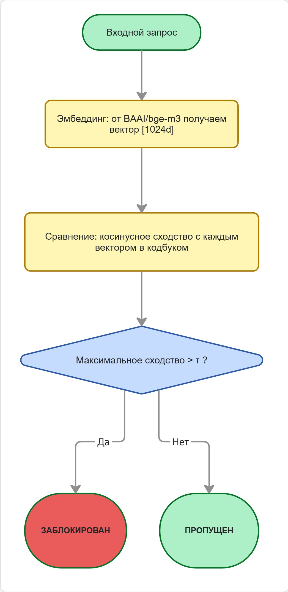
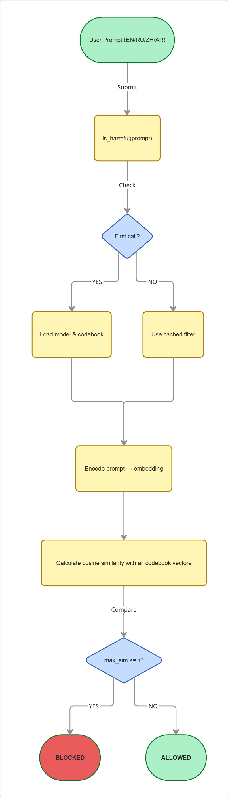

# ML System Design Document - [RU]
## Дизайн ML системы -  Обнаружение мультиязычных вредоносных запросов с помощью семантического анализа

### 1. Цели и предпосылки

#### 1.1. Зачем идем в разработку продукта?

**Бизнес-цель:**

Повышение устойчивости LLM-систем к манипулятивным запросам на языках, отличных от английского, за счёт раннего обнаружения вредоносного намерения до передачи запроса модели. 
Это снижает риски генерации опасного или нарушающего политику контента в мультиязычных интерфейсах.

**Почему станет лучше:**  

Существующие системы фильтрации часто обучены только на английском языке и не учитывают семантическую близость запросов на других языках к известным вредоносным паттернам. 
Предлагаемый подход использует **семантические эмбеддинги**, что позволяет детектировать злонамеренные запросы независимо от языка их формулировки — особенно важно для глобальных продуктов.

**Критерий успеха итерации:**  

Снижение доли успешных jailbreak-атак на ≥10% при тестировании на переведённых датасетах по сравнению с отсутствием фильтрации.

---

#### 1.2. Бизнес-требования и ограничения

**Краткое описание бизнес-требований:**  

- Нет формальных бизнес-требований. Цель — проверка научной гипотезы:
  - Семантическое сходство между вредоносными промптами на английском языке и их переводами на другие языки (например, русский, китайский и арабский) достаточно высоко, чтобы позволить обнаруживать
    
  - Мультиязычные вредоносные атаки, используя только эмбеддинги, обученные на английском, без явного их перевода.
    
  - Система должна детектировать вредоносные запросы на минимум 3 языках (RU/ZH/AR) без явного машинного перевода на английский на этапе инференса
  
- Поддержка как минимум 4 языков: английский, русский, китайский и арабский
  
- SLA: ≤ 2 сек на обработку одного запроса (после инициализации системы)
  
- Пропускная способность: ≥ 2 запроса/сек на целевой инфраструктуре
  
- Надёжность: система должна работать без сбоев при последовательной обработке ≥1000 запросов


**Бизнес-ограничения:**  

- Нельзя использовать закрытые/платные эмбеддинг-модели без лицензирования.
- Нельзя использовать платные API (только открытые модели).
- Нет необходимости в развертывании — только эксперимент в Jupyter/Python.

**Ожидания от итерации:**  

- Доказать техническую осуществимость и эффективность подхода на основе семантической векторной базы вредоносных намерений. 
- Получить метрики качества, достаточные для принятия решения о дальнейшей продуктивизации/интеграции.

**Описание бизнес-процесса пилота:**  

  Пилот представляет собой контролируемый эксперимент: на наборе синтетических и открытых вредоносных запросов оценивается способность фильтра обнаруживать вредоносные атаки, без внешней интеграции.

**Критерии успешного пилота:**  

- Успешный пилот: использование нашей системы перед отправкой запроса в LLM показывает лучшие результаты чем отправка запроса прямиком в LLM. То есть наша система блокирует те запросы, с которыми сама LLM не справляется (метрика `is_catched` = "кол-во запросов, которые заставили LLM дать ответ на вредоносный запрос" стала ниже)
- Возможность быстрой адаптации под новые языки и типы атак.  
- Путь развития: интеграция в safety stack и переход к онлайн-инференсу.

---

#### 1.3. Скоуп проекта/итерации

**Что входит:**  

- Перевод датасета на 2 целевых языка (русский и китайский) + валидация качества перевода.  
- Построение семантический векторной базы вредоносных намерений
- Проверка гипотезы о применимости семантического анализа для обнаружения вредоносных запросов на отличных от английского языках.
- Оценка эффективности фильтра на переведённых вредоносных промптах
- Подготовка воспроизводимого пайплайна (Docker + config files + evaluation script).


**Что не входит:**  

- Обучение собственных эмбеддингов.
- Онлайн-инференс или масштабирование системы.
- Разработка UI/UX компонентов.  
- Обучение новой LLM.  
- Интеграция в production API (только offline-оценка и mock inference).  

**Описание результата с точки зрения качества кода и воспроизводимости решения:**  

- Код размещён в публичном репозитории с .pre-commit-config.yaml, pyproject.toml, requirements.txt.
- Все зависимости зафиксированы, конфигурации параметризованы.
- Эксперимент воспроизводится через Jupyter notebook или скрипт.

**Описание планируемого технического долга (что оставляем для дальнейшей продуктивизации):**  

- Отсутствие оптимизированного поиска (FAISS/HNSW)
- Отсутствие онлайн-инференс-сервиса (только batch/offline)
- Нет механизма обновления векторной базы в runtime
- Нет механики активного обучения (добавления новых атак по мере их появления)
- Нет мониторинга дрейфа: если распределение запросов по языкам/типам сильно изменится, фильтр может деградировать

---

#### 1.4. Предпосылки решения

- **Данные:** Используются открытые датасеты вредоносных промптов.  
- **Горизонт прогноза:** Instant — решение принимается per-query.  
- **Гранулярность:** На уровне одного текстового запроса.
- **Предположение:** Семантические эмбеддинги сохраняют смысл при переводе — т.е. перевод вредоносного промпта остаётся близок к оригиналу в векторном пространстве.
- **Модель:** Используется предобученный multilingual sentence transformer `BAAI/bge-m3` — не требуется обучение с нуля.

---


### 2. Методология

#### 2.1. Постановка задачи

Задача формулируется как **семантическая классификация намерений**: определить, принадлежит ли входной запрос к множеству «вредоносных намерений», представленных в виде кодбука эмбеддингов. Целевой формат выхода - бинарное решение (**блочить / пропустить**). Это задача **поиска аномалий** на основе косинусного сходства.

---

#### 2.2. Блок-схема решения



#### 2.3. Этапы решения задачи

##### Этап 1. Подготовка данных

Исходные данные представляют собой текстовые промпты с бинарной разметкой: безопасный / небезопасный (0/1) и семантическими эмбеддингами для каждого промпта размерности 1024.

##### Описание данных

1. **Кодбук** - это набор семантических эмбеддингов (векторных представлений) известных вредоносных промптов на английском языке, используемый в качестве эталонного «банка намерений» для обнаружения cross-lingual jailbreak-атак.
   
    То есть, когда поступает новый запрос (на любом языке), он преобразуется в эмбеддинг и сравнивается по косинусному сходству с векторами из кодбука. Если сходство превышает заданный порог — запрос считается потенциально вредоносным и блокируется.

    Кодбук построен на основе всех `unsafe` промптов из датасета `jayavibhav/prompt-injection-safety[train]`, прошёл очистку (удаление дубликатов, коротких и небуквенных промптов) и верификацию меток с помощью моделей `Prompt-Guard-86M` и `Qwen3Guard-Gen-4B`. Каждый промпт преобразован в эмбеддинг размерностью 1024 с помощью `BAAI/bge-m3`. В результате размер получившегося кодбука равен **13 811**.
   
3. **Бенчмарки** - были выбраны 4 датасета, содержащими безопасные и вредоносные промпты. В качестве EDA проведен только процесс дедупликации, а фильтрация по длине или смыслу текстов не производилась. Для тестовых бенчмарков метки принимались как есть (качество не верифицировалось дополнительно). Все тексты бенчмарков также были преобразованы в эмбеддинги с использованием `BAAI/bge-m3`. Далее перечисление названий датасетов из Hugging Face и конечные их размеры после дедупликации:
   
     - `jayavibhav/prompt-injection-safety[test]` - 10000
  
     - `xTRam1/safe-guard-prompt-injection[train]` - 8123
  
     - `JailbreakBench/JBB-Behaviors (behaviors)` - 200
  
     - `nvidia/Aegis-AI-Content-Safety-Dataset-2.0` - 1882

4. **Переводы**
   Перевела тексты промптов 4 бенчмарков на русский, китайский и арабский языки с помощью `Google Translate` и модели “facebook/m2m100_418M”. Качество переводов не оценивалось так как *цель перевода*: смоделировать реальный сценарий, при котором злоумышленник использует общедоступный переводчик для атаки на LLM.

##### Оценка качества и рисков данных

- **Объём данных** 
  
    Тысячи промптов, 4 бенчмарка, 4 языка, достаточен для проверки гипотезы на уровне proof-of-concept. На текущем этапе дополнительных данных не требуется.

    В случае необходимости расширения:
    
     - Можно генерировать синтетические jailbreak-промпты (paraphrasing, template-based generation).
       
     - Использовать активное обучение для пополнения кодбука на основе ошибок фильтра.
 
- **Качество текстов и разметки**

    - В кодбуке (на основе jayavibhav/prompt-injection-safety[train]) проведена тщательная очистка: удалены дубликаты, промпты короче 5 слов и бессмысленные фразы.
      
    - В кодбуке метки вредоносности верифицированы с помощью двух независимых моделей-гардов (Prompt-Guard-86M и Qwen3Guard-Gen-4B). 
      
    - В тестовых бенчмарках разметка принималась «как есть» без дополнительной верификации, что может вносить шум, но соответствует реалистичному сценарию использования внешних датасетов.
 
- **Качество переводов**
  
    Переводы на русский, китайский и арабский выполнены с помощью `Google Translate` и модели `facebook/m2m100_418M`.
  
    Специально не проводилась пост-обработка или верификация качества перевода, поскольку цель - смоделировать реалистичный сценарий: злоумышленник использует общедоступные автоматические переводчики для атаки LLM. Таким образом, возможные искажения смысла, грамматические ошибки или странная формулировка являются частью экспериментального дизайна, а не недостатком данных.


- **Конфиденциальная информация:** 

    Все датасеты являются публичными, исследовательскими, не содержат персональных данных или конфиденциальную информацию. Специальная анонимизация не требуется.

##### Необходимый результат этапа

- Очищенный, дедуплицированный кодбук 

- Бенчмарки (оригиналы + переводы на 3 языка) с сохранённой разметкой.
  
- Векторизованные представления всех промптов (промптов кодбука и бенчмарков).
  
- Таблица cosine similarity scores между каждым тестовым промптом и ближайшим вектором из кодбука.
  


##### Этап 2. Подготовка прогнозных моделей

В данном проекте «прогнозная модель» реализована в двух формах:

- LLM baseline: Llama-3.2-3B-Instruct и Qwen-3-4B, используемые как «жертвы» атак

- Семантический фильтр: non-parametric модель на основе косинусного сходства с кодбуком.

##### Описание ML-метрик и функций потерь

  Поскольку задача — бинарная классификация (вредоносный / безопасный), использованы следующие метрики:
  
  - **Attack Success Rate (ASR)** — доля вредоносных промптов, на которые LLM дал опасный/запрещённый ответ. Основная метрика эффективности защиты. ASR напрямую отражает бизнес-риск (генерация вредоносного ответа)
  
  - **False Positive Rate (FPR)** — доля безопасных промптов, ошибочно заблокированных фильтром (для семантического подхода). FPR — бизнес-ограничение (недопустимость блокировки хороших запросов). 
    
  - **True Positive Rate (TPR / Recall)** — доля вредоносных промптов, корректно обнаруженных фильтром.
  
  - **Threshold (τ)** — не функция потерь, а гиперпараметр принятия решения: если `cosine_similarity ≥ τ` → `is_harmful = True`.

  Классические метрики (accuracy, F1) не используются, так как данные сбалансированы искусственно, а фокус — на безопасности.


##### Описание схемы ML-валидации
  
  - **Разделение на обучение и тест.**

    Кодбук построен из промптов датасета `jayavibhav/prompt-injection-safety[train]`.
  
    Оценка проводится на 4 независимых бенчмарках, не использовавшихся при создании кодбука. В итоге, мы получаем минимизацию data leakage.
  
  - **Языковая валидация.**
  
    Каждый бенчмарк оценивается в 4 вариантах:
      – оригинал (EN)
      – перевод (RU, ZH, AR)
    В итоге, это позволяет оценить межязыковую обобщающую способность.
  
  - **Валидация LLM-baseline**.
  
    Каждый промпт подаётся в LLM и ответ оценивается вручную (ключевые слова отказа отвечать) и через judge-LLM → `is_catched ∈ {0, 1}` - была ли LLM обманута?.
  
  Обоснование такого выбора схемы ML-валидации:
  – Нет необходимости в кросс-валидации потому что модель non-parametric.
  – Датасеты из разных источников и мы минимизируем data leakage.
  – Межязыковая оценка — ключевое требование задачи.


##### Описание структуры бейзлайна

  - **Бейзлайн 1: LLM без фильтрации**

    *Модели:* `Llama-3.2-3B-Instruct`, `Qwen-3-4B`.
    
    *Процесс:* Все промпты из 4 бенчмарков (в 4 языковых вариантах) подаются в LLM.
    
    *Ответы анализируются:*
    
      - 1 — LLM выполнил вредоносную инструкцию
      
      - 0 — отказался или дал безопасный ответ.
      
    *Результат:* базовый уровень ASR (например, x% для EN, y% для переводов).
    
  - **Бейзлайн 2: Семантический фильтр**
    
    *Формула:*
    
      `is_harmful = 1 if max_cos_sim(prompt_emb, codebook_emb) ≥ τ else 0`
    
    *Эмбеддер:* BAAI/bge-m3 (размерность векторов 1024).
    
    *Порог `τ`:* подобран на валидационной выборке.
    
    *Прогноз:* бинарный (блокировать / пропустить).

    *Результат:* новый уровень ASR, сравнение с базовым уровнем LLM без фильтрации

##### Анализ и интерпретация работы модели
  
  Интерпретация результатов будет основана на сравнении эффективности семантического фильтра и базового сценария без фильтрации.
  
  Если применение фильтра приводит к снижению числа успешных вредоносных-атак (по сравнению с LLM, получающим запросы напрямую), это будет свидетельствовать о том, что гипотеза проекта верна: семантическое сходство позволяет обнаруживать мультиязычные атаки без перевода кодбука.
  Ошибки фильтра (как ложные срабатывания, так и пропуски) будут анализироваться для понимания границ применимости подхода.


##### Риски данного этапа и как мы их решили

  - *Data leakage между кодбуком и тестом*

    Использованы непересекающиеся датасеты и проверка на дубликаты

  - *Низкое качество перевода и/или искажение смысла*

    Это часть дизайна — смоделирован реальный сценарий
    
  - *Смещённая разметка в тестовых бенчмарках*

    Использование нескольких независимых источников
  
  - *Выбор suboptimal порога `τ`*

    Подбор по валидационной выборке + анализ ROC-кривой

##### Необходимый результат этапа

  - Таблица ASR для LLM-baseline (по языкам и датасетам).
  
  - Таблица TPR/FPR для семантического фильтра (по языкам, при разных τ).
  
  - Вывод: насколько эффективен семантический фильтр по сравнению с baseline.
  
  - Рекомендация по значению порога τ отдельно для каждого языка.

##### Ключевые наблюдения и преимущества подхода

  - Использование двух LLM (Llama и Qwen) позволило оценить разброс уязвимости — разные модели по-разному реагируют на одни и те же атаки.
  
  - Семантический подход не требует перевода кодбука — это его главное преимущество.
  
  - Даже грубые переводы (Google Translate и facebook/m2m100_418M) сохраняют достаточную семантическую близость для обнаружения — что подтверждает гипотезу проекта.


##### Стратегии дальнейшего развития решения
  
  - Улучшение эмбеддингов:
  
    - Взятие других моделей для создание эмбеддингов и сравнение какой лучше
    
    - Использование LLM моделей, предназначенных для получения эмбеддингов (н-р, `text-embedding-3-large`)
      
  - Гибридный подход:
  
    - Комбинация семантических эмбеддингов + simple classifier (н-р, логистическая регрессия)
   
    - Пополнение кодбука через активное обучение (ошибки фильтра → ручная разметка → добавление) или через новые категории вредоносных запросов.


##### Этап 3. Оценка эффективности фильтрации

  *Цель этапа:* Количественно и качественно оценить, насколько предложенный семантический фильтр снижает уязвимость LLM к cross-lingual jailbreak-атакам по сравнению с базовым сценарием без фильтрации.

##### Методология оценки

  - Оценка проводится на четырёх независимых бенчмарках

  - Каждый бенчмарк оценивается в четырёх языковых вариантах: EN (оригинал), RU, ZH, AR (переводы)

  - Для каждого варианта выполняются два сценария:

    - **Baseline:** промпт подаётся напрямую в LLM (Llama-3.2-3B-Instruct, Qwen-3-4B) и полученный ответ оценивается на наличие вредоносного содержания.
   
    - **С фильтром:** Промпт сначала проходит через наш семантический фильтр. Если max_cos_sim ≥ τ — запрос блокируется, и в LLM не попадает. Иначе - отправляется в LLM и обрабатывается как в baseline.

  - Метрики оценки: ASR, TPR, FPR,

  - Порог τ подбирается на валидационной выборке для каждого языка

##### Риски и способы их решения

  - *Смещение оценки ответов LLM*

    Использование двух judge-стратегий: ручной анализ по ключевым фразам отказа и оценка через LLM-as-Judge метод.

  - *Неоднородность разметки в тестах*

    Усреднение метрик по всем 4 бенчмаркам, а не по одному

  - *Искажение смысла при переводе*

    Принято как часть экспериментального дизайна, так как цель - это реалистичная симуляция атак через Google Translate или перевод языковой моделью вредоносного запроса.


##### Необходимый результат этапа

  - Сводная таблица ASR, TPR, FPR по всем языкам и бенчмаркам.
  
  - График ΔASR по языкам.

  - Численный вывод: «Семантический фильтр снижает ASR в среднем на X% при FPR ≤ Y%».
  

##### Этап 4. Подготовка итогового аналитического отчёта для бизнеса

##### Цель этапа

  Систематизировать результаты проведённого эксперимента, сформулировать вывод по проверке центральной гипотезы проекта и зафиксировать рекомендации для дальнейшего развития подхода. Отчёт служит завершающим этапом итерации и представляет собой аналитическую основу для потенциальной публикации, технической документации или интеграции в более широкую систему безопасности LLM.

##### Состав отчёта

  Итоговый отчёт включает следующие компоненты:
  
  - *Сравнительный анализ эффективности*
  
    - Сводная таблица с ASR, TPR, FPR по всем языкам и бенчмаркам для сценариев с фильтром и без фильтра
    
    - График ΔASR (абсолютное снижение уязвимости) по языкам.
  
  - *Проверка гипотезы*
    
    Итоговые ответы на вопросы:
  
    - Достаточно ли семантического сходства между вредоносными промптами на английском и их переводами, чтобы позволить обнаружение мультиязычных атак без перевода кодбука?

    - Возможно ли определить с помощью семантического эмбеддинга вредоносное намерение запроса на русском, китайском или арабском языках без его перевода на английский язык?
    
  - *Ограничения исследования*

    - Использование автоматических переводов без пост-редактуры.
    
    - Оценка только на 4 языках (отсутствие охвата малоресурсных языков).
    
    - Отсутствие динамической адаптации порога τ под категории атак.

  - *Рекомендации по развитию*
  
    Формулировка краткосрочных и долгосрочных идей и планов по развитию проекта или формулировка новых гипотез для проверки.


### 3. Подготовка пилота  
  
#### 3.1. Способ оценки пилота  
  
Пилот задумывается как контролируемый offline-эксперимент для сравнения двух сценариев:

- Baseline: прямая подача запроса в LLM (Llama-3.2-3B-Instruct, Qwen-3-4B),

- С фильтром: запрос сначала проходит через семантический фильтр на основе BAAI/bge-m3; если не заблокирован -- подаётся в ту же LLM.


Оценка должна проводиться по:

- Aailbreak Success Rate (ASR) -- доля вредоносных промптов, на которые LLM дал опасный ответ,

- TPR/FPR -- для анализа качества фильтра.


Реализация:

- Протестировать все 4 бенчмарка (в 4 языках: en, rus, zh, ar) в обоих сценариях.

- Оценка ответов LLM как ручной разметкой по ключевым фразам отказа, так и классификацией через LLM-as-Judge.
  
- Вычисление сosine similarity между тестовыми промптами и кодбуком (13 811 эмбеддингов).
  
#### 3.2. Что считаем успешным пилотом  
  
Критерии успеха:

- Снижение ASR на ≥10%  по сравнеию с baseline хотя бы на одном неанглийском языке

- FPR не превышает 20% (чтобы не блокировать чрезмерное число легитимных запросов)
  
- Эффект наблюдается на обоих LLM (Llama и Qwen), что подтвердит устойчивость подхода

- Гипотеза о языконезависимости семантического сходства подтверждается эмпирически
  
#### 3.3. Подготовка пилота  

Что можем позволить себе, исходя из ожидаемых затрат на вычисления:

- Все эмбеддинги вычисляются однократно и сохраняются на диск

- Запуск экспериментов на CPU + GPU Н100

- Время ответа: ~2 сек

- Уложить затраты в выделенный бюджет
  
Планируемые ограничения:

- Offline-режим
  
- Brute-force cosine similarity (без FAISS/HNSW) -- так как размер кодбука 13 811 позволяет уложиться в приемлемое время на CPU
  
- Генерация ответов LLM выполняется пакетно (т.е. с `max_new_tokens=256`, `temperature=0.0`, `do_sample=False`) -- для детерминированности и снижения затрат


### 4. Внедрение 

В данном случае результатом итерации является воспроизводимый offline-инференс-модуль, предназначенный для проверки гипотезы и последующего использования в пилотных экспериментах. Система не развёрнута как сервис, но предоставляет программный интерфейс для интеграции в будущие safety-стеки.

#### 4.1. Общее описание

Система реализована как Python-модуль для offline-инференса, предназначенный для проверки текстовых запросов на принадлежность к множеству вредоносных намерений без перевода на английский язык.

Основной интерфейс — функция `semantic_filter.is_harmful(prompt, model, threshold) -> True/False` класса `SemanticJailbreakFilter`. Эта функция:
- принимает строку на любом из поддерживаемых языков (EN/RU/ZH/AR), опционально модель и порог,
- вычисляет её семантический эмбеддинг с помощью модели `BAAI/bge-m3`, которую можно развернуть у себя и просто передать с помощью аргумента `model`,
- сравнивает с предварительно подготовленным кодбуком из 13 811 эмбеддингов вредоносных запросов,
- возвращает `True`, если максимальное косинусное сходство ≥ порога `τ`, то есть `True` означает что данный запрос вредоносный.

Решение работает полностью offline после первой инициализации и не требует внешних API.

  
#### 4.2. Архитектура решения   
  
##### Блок схема:



##### Пояснения:

*Вход:*  
- текстовый запрос `prompt (str)`
- опционально: модель `model (SentenceTransformer)` и порог `threshold (float)`.

*Инициализация (однократно):*
- Загрузка `SentenceTransformer("BAAI/bge-m3")`.
- Загрузка кодбука из `codebook_embeddings.jsonl` (автоматически с Hugging Face Hub при отсутствии).
- Нормализация всех эмбеддингов кодбука по L2.
  
*Обработка запроса:*
- Эмбеддинг запроса вычисляется с `normalize_embeddings=True`.
- Косинусное сходство считается между этим вектором и всеми векторами кодбука.

*Принятие решения:*
- Если максимальное сходство ≥ threshold → `True`.
- Иначе → `False`.

*Компоненты:*
- Модель: BAAI/bge-m3 (multilingual, 1024d).
- Кодбук: 13 811 unsafe-эмбеддингов в формате JSONL.
- Функция: `is_harmful()` — stateless после инициализации.
   
  
#### 4.2. Описание инфраструктуры и масштабируемости 
  
Выбранная инфраструктура:
- Локальная машина или виртуальная машина (CPU-only)
- Python ≥ 3.8
- Библиотеки: sentence-transformers, scikit-learn, numpy
- Хранилище данных: Hugging Face Hub (публичный датасет)


Почему выбрано:
- Соответствует ограничению: *Нет необходимости в развертывании — только эксперимент в Jupyter/Python*.
- Минимизирует зависимости и сложность.
- Позволяет легко воспроизвести результаты на любой машине.

Плюсы:
- Полная автономность после первой загрузки
- Низкий порог входа (не требует Docker, Kubernetes, облачных аккаунтов)
- Прозрачность кода и данных

Минусы:
- Нет горизонтального масштабирования
- Brute-force поиск не масштабируется на миллионы записей
- Зависимость от внешнего URL при первом запуске

Почему это лучше альтернатив для MVP:
- Развертывание FastAPI/Docker потребовало бы времени и для исследования не является обязательным.
- Использование Git LFS увеличило бы сложность для проверяющего (требует установки git lfs).
- Текущее решение — соответствует критериям для проверки гипотезы и для презентации работы решения.

  
#### 4.3. Требования к работе системы  
  
Требования к производительности определены исходя из ограничений в разделе 1.2: *«Время ответа: ~2 сек»*.  

Фактические результаты нагрузочного тестирования:
- Время первого запроса (инициализация модели + загрузка/парсинг кодбука): 6.75 сек
- Среднее время последующих запросов: 0.354 сек/запрос
- Пиковое потребление RAM: ~2.7 ГБ

> Описание сервера, на котором проводилось нагрузочное тестирование: ОС: Linux 5.15.0-163-generic, CPU: x86_64, 256 ядер, RAM: 377.7 ГБ.

*Итого:* Все замеры удовлетворяют SLA ≤ 2 сек, даже если брать типичную пользовательскую машину (4–8 ядер), где время может быть выше (~0.8–1.5 сек), наше решение всё равно будет укладываться в SLA.

  
#### 4.4. Безопасность системы  
  
Потенциальные уязвимости:
- Если злоумышленник получит доступ к репозиторию на Hugging Face Hub, то он может заменить кодбук на «безопасный», отключающий фильтрацию.
- При недоступности huggingface.co и если кодбука нет в кэше, то запуск невозможен.
- BAAI/bge-m3 может некорректно скодировать очень короткие или искажённые запросы.
  
#### 4.5. Безопасность данных   
  
- Все исходные датасеты являются публичными, исследовательскими, не содержат персональных данных.
- Кодбук содержит только тексты вредоносных промптов (без email, имён, IP и т.д.).
- Данные не передаются третьим лицам — инференс происходит локально.
- Нарушений GDPR, CCPA и других регуляторных требований нет, так как:
  - Нет сбора пользовательских данных
  - Нет хранения запросов
  - Нет обработки персональной информации
  
#### 4.6. Издержки  

- Хостинг модели (CPU, 4 vCPU, 8 ГБ RAM, 24/7): ~$10-30/мес (Yandex Cloud / AWS)
- Хранение кодбука на HF Hub: бесплатно

*Итого:* ~$10-30/мес

  
#### 4.5. Integration points  

> Перед первым запуском любым из способов необходимо установить зависимости:
> `pip install -r requirements.txt`
  
Система предоставляет единую точку интеграции:

- Python-функция:
  ```python
  from semantic_filter import is_harmful
  if is_harmful(user_input):
      block_request()
  else:
      request_to_llm(user_input)
  ```
  
- CLI-интерфейс:
  ```bash
  python cli_filter.py "Как обойти фильтр?"  # → BLOCKED
  ```

- Jupyter Notebook:

  Пример использования в ноутбуке `testing/Testing.ipynb`

В будущем возможна интеграция через:

- HTTP API
- LangChain Safety Tool
  
#### 4.6. Риски  
  
- Кодбук может не покрывать новые типы атак. Этот риск частично смягчается семантической природой подхода (сходство по смыслу), но не устраняется полностью.

- Производительность может деградировать при расширении кодбука от текущего размера (13 811) до сотен тысяч записей и более.

- Существует зависимость от внешнего источника данных — Hugging Face Hub. При недоступности репозитория и отсутствии кодбука локально, запуск системы будет невозможен.


   
